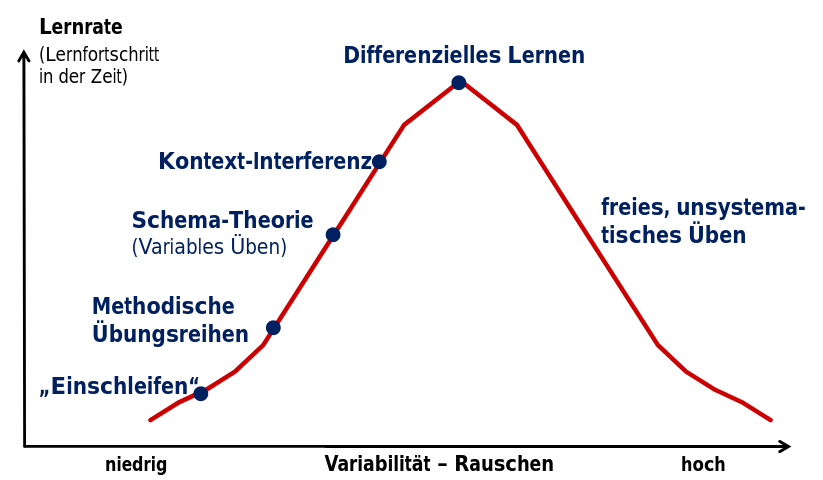

== Individualität der Bewegungen

Zusätzlich zum Unmöglichkeit, identische Bewegungen auszuführen
include::partial$gen/bibliography.adoc[tag=SDLL]
ist inzwischen bekannt, dass der Variationsbereich individueller Bewegungen in jedem Leistungsniveau erstaunlich hoch ist
include::partial$gen/bibliography.adoc[tag=IIMSHP]
.

Eine personen-übergreifende Idealtechnik ist als solche nicht mehr haltbar. Abzugrenzen ist, dass einige Variationen der Bewegungsausführung offensichtlich untauglich oder hoch problematisch sind. Solche Variationen werden Lernende aber ohnehin schnell eliminieren, wenn ihnen besser geeignete Variationen angeboten werden.

Auch für Trainer:innen sind Idealtechnik und einschleifende Lehrverfahren riskant: Niemand kann alle Fehler und Abweichungen erkennen und die Konsequenz jeder individuellen Ausführung sicher abschätzen. Es besteht die Gefahr, unbewusst fehlerhafte Ausführungen einzuschleifen. Glücklicherweise ist ein Einschleifen am Ende ohnehin nicht möglich, weil jede Wiederholung zwangläufig neue Abweichungen aufweisen muss. Folge bleibt in jedem Fall eine deutlich erhöhte Lernzeit.

Neuere Lernverfahren wie das differenzielle Lernen
include::partial$gen/bibliography.adoc[tag=InVP]
gehen davon aus, dass eine Verstärkung der ohnehin auftretenden Fluktuationen im Lernprozess eine leistungssteigernde Wirkung besitzen.

Wir wollen daher keine ideale Zieltechnik vorgeben, sondern mögliche (durchaus weite) Lösungsbereiche suchen, in denen das Training stattfindet. Wir gehen davon aus, dass die Interpolationsfähigkeit des Menschen es ermöglicht, das individuelle Ideal zwischen bekannten Werten zu ermitteln.

[[grundlagen-training-differenzielle-methode]]
== Differenzielle Lernmethode

Für dieses Training wird der Randbereich des Lösungsraums abgetastet, in dem der Athlet dann situationsbezogen interpoliert.

Im gesamten Lernprozess wird keine Aufgabe unverändert wiederholt, sondern der Athlet stets mit neuen Aufgaben konfrontiert. Zentraler Ansatz ist es, den Athleten auf das Neue in verstärkter Form vorzubereiten, weil es ohnehin bei einfacher Wiederholung in abgeschwächter Form auftritt
include::partial$gen/bibliography.adoc[tag=SDLL]
. Es wird also die Anpassungsfähigkeit an neue Aufgaben betont.

Ein Aspekt des einschleifenden Lernens ist die hohe Wiederholungszahl. Diese ist tatsächlich für den Lernprozess notwendig, denn nur viele Wiederholungen führen zu relevanten neuroplastischen Änderungen im Gehirn (CITE REQUIRED). Es ist allerdings darauf zu achten, dass weiterhin hohe Fehlerraten erreicht werden können: Werden Bewegungen nahezu fehlerfrei ausgeführt, dann kann kaum noch Lernen stattfinden.

Wir wollen unseren Schüler:innen eine für sie neue Technik nur kurz erläutern. Detaillierte Erklärungen und Demonstrationen sollen zugunsten einer hohen Wiederholungszahl und dem Abtasten eines großen Lösungsbereiches zurückstehen.

Ständiges Konfrontieren mit neuen Aufgaben ist einer der Kerne der differenziellen Lehrmethode und erlaubt nicht nur die Interpolation und Adaption auf neue Situationen, sondern stellt auch sicher, dass die Schüler:innen ein hohes Maß an Fehlern begehen, die das notwendige Feedback für neuroplastische Adaptionen bereitstellen.

Stabilität im Ganzen wird dabei zum Nebenprodukt, dass durch Anpassungsfähigkeit im Kleinen geschult und erzielt wird.

Ein zusätzlicher Vorteil wird beim Lehren von Kindern und Jugendlichen erzielt, die durch fortlaufend ändernde Einflussfaktoren (Wachstum, Änderung der Proportionen, …) ständiger Anpassungen ihrer Technik bedürfen, die zumindest in der Gruppe von einem Lehrenden nicht mehr geleistet werden kann
include::partial$gen/bibliography.adoc[tag=DLPVSS]
.

Wichtig dabei ist, dass bei der Umsetzung nicht nur die theoretisch optimale, konkrete Lösung durch Variation gegen andere Lösungen stabilisiert wird. Statt dessen wird ein Lösungsraum umkreist, um auf jeden Fall neue, situativ optimale Lösungen auszuführen.

== Effektivität und Effizienz der differenziellen Lehrmethoden

In verschiedenen Sportarten wurde die differenzielle Lehrmethode mit Erfolg angewandt. Zu einer ganzen Reihe davon sind Studien veröffentlicht. So im Fußball
include::partial$gen/bibliography.adoc[tag=DLiSc]
, Kugelstoßen
include::partial$gen/bibliography.adoc[tag=DLiSP]
, Golf
include::partial$gen/bibliography.adoc[tag=MTSG]
, Tennis
include::partial$gen/bibliography.adoc[tag=DLTTA]
, Handball
include::partial$gen/bibliography.adoc[tag=WHBAT]
, Volleyballinclude::partial$gen/bibliography.adoc[tag=DLeiVb]
, Radsport
include::partial$gen/bibliography.adoc[tag=VBDTR]
, Ausdauertraining
include::partial$gen/bibliography.adoc[tag=DAVNW]
.

In allen untersuchten Fällen wurde die Vorhersage größerer Effektivität des differenziellen Lernansatzes durch Verstärkung des Rauschens bei Anfängern und Fortgeschrittenen bestätigt (signifikant bis hoch signifikant, p=0,02 bis 0,04).

Schon am Ende der untersuchten Interventionen wird der Vorteil gegenüber anderen Ansätzen messbar. Bei Retentionstests ist nicht nur ein geringerer Leistungsrückgang zu messen, sondern im Gegensatz dazu sogar Leistungssteigerungen nachgewiesen.

.Darstellung  der  Integration  aller  Lerntheorien  mit  Hilfe  des  Parameters  „Rauschen“

aus
include::partial$gen/bibliography.adoc[tag=SPAFESA]

Bei der Auswahl geeigneter Lernverfahren für Training im Verein ist die Anwendbarkeit in großeren Gruppen. Dabei ist davon auszugehen, dass jeder Lernende ganz eigene, unterschiedliche Voraussetzungen mitbringt, die jeweils zu unterschiedlichen Leistungsoptima führen muß.

Hier kann differenzielles Lernen Vorteile bieten.

Werden einer Gruppe 5 Übungen angeboten, ist die Wahrscheinlichkeit, die Voraussetzungen aller Gruppenmitglieder zu treffen deutlich geringer, als wenn 60 Übungen angeboten werden.
